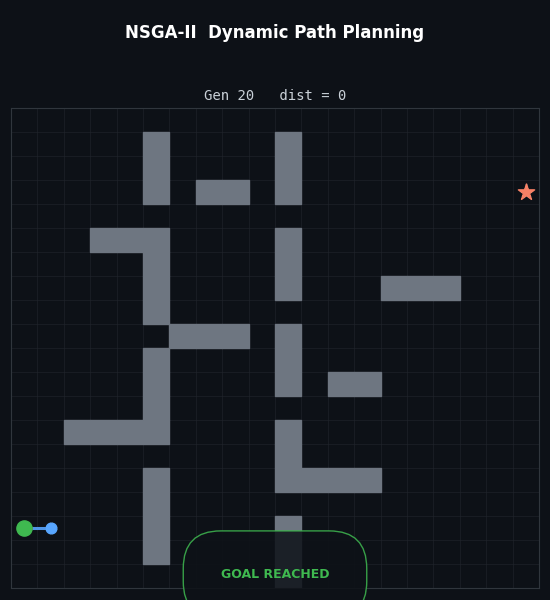
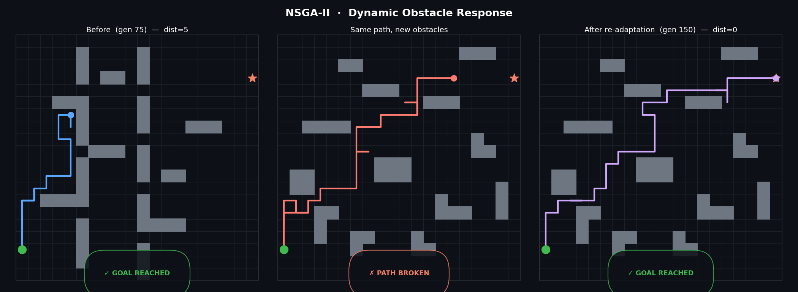
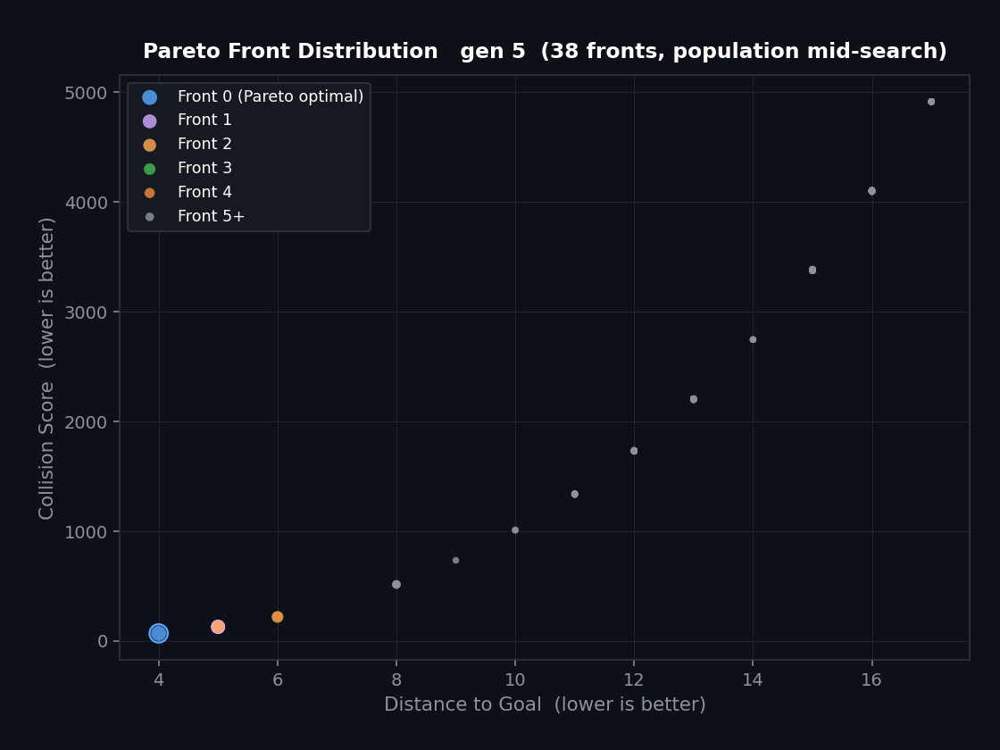
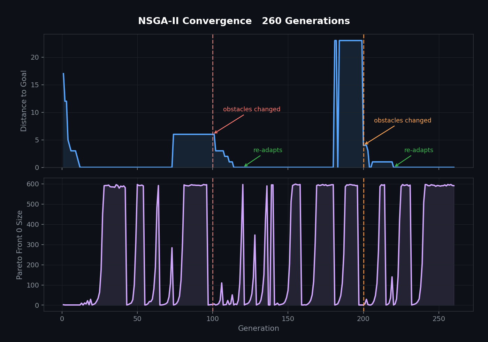

# Dynamic Path Planning
 
A from scratch implementation of the **Non-dominated Sorting Genetic Algorithm II (NSGA-II)** applied to path planning on a dynamic obstacle grid. The environment changes mid-run. The algorithm adapts.
 
<p align="center">
  
</p>

---
 
## What it does
 
300 candidate paths compete across generations on a 20x20 grid. Each path is a sequence of moves (`UP`, `DOWN`, `LEFT`, `RIGHT`) starting from a fixed position and trying to reach a goal. Every generation, bad paths die and good ones breed.
 
What makes it interesting is that "good" is not a single thing. Three objectives are in tension:
 
- **Distance** : how far the final position is from the goal
- **Collisions** : how many times the path hits a wall
- **Length** : how long the path is
 
No single path wins on all three simultaneously. A shorter path might be farther from the goal. A collision free path might be unnecessarily long. NSGA-II handles this by maintaining a *Pareto front*, a set of solutions where you cannot improve one objective without making another worse.
 
When the obstacles shift, the previously optimal paths are suddenly broken. The algorithm detects this, invalidates cached fitness values, injects fresh random immigrants into the population, and re-evolves finding a new Pareto front for the new environment.
 
---
 
## How the Algorithm works here
 
**Each generation:**
 
1. **Evaluate** — every candidate runs its move sequence on the current grid. Three objective scores are computed.
2. **Pareto rank** — candidates are sorted into *fronts*. Front 0 contains all candidates not dominated by anyone else. Front 1 contains all candidates not dominated once Front 0 is removed. And so on.
3. **Crowding distance** — within each front, candidates are ranked by how isolated they are in objective space. This preserves diversity and prevents the front from collapsing to a single point. (mine still lacked diversity and it didnt fix it for some reason)
4. **Tournament selection** — pairs of candidates compete. Better front wins. Equal front: better crowding distance wins.
5. **Crossover** — two parents splice their move sequences at a random point (between 20% and 80% of the shorter path's length).
6. **Mutation** — two types: point mutation (randomly flip a single move, rate 0.1%) and insert/delete mutation (add or remove a random move at a random position, rate 1%).
7. **Next gen selection** — parents and offspring are combined (600 candidates), re-ranked, and trimmed back to 300 by taking the best fronts in order, with crowding distance as the tiebreaker on the boundary front.
 
**When obstacles change:**
 
- All cached objective scores are invalidated and recomputed on the new grid
- 30% of the population is replaced with new random candidates (immigration)
- The population re-evolves from this mixed state
 
---
 
## The fitness function problem
 
The objectives are defined as:
 
```
distance  = manhattan distance from final position to goal
collisions = raw_collision_count + distance^3
length    = path_length^0.01 + distance^5
```
 
The `distance^3` and `distance^5` terms are there because of a real bug: without them, the algorithm found it was optimal to stop halfway. If the goal is too far and the path is too long, stopping in the middle scores well on *both* length and distance simultaneously. It was technically correct given the objectives as stated.
 
The fix was adding heavy polynomial penalties to both collision and length scores whenever the path ends far from the goal. This makes reaching the goal effectively non-negotiable, which is what was actually wanted all along.
 
---
 
## Visualizations
 
**Before / After obstacle change**
 

 
The same path that solved the original layout is immediately broken on the new one. The third panel shows the re-adapted solution after the algorithm recovers.
 
**Pareto front (gen 5)**
 

 
Early in the run, candidates are spread across objective space with many fronts visible. Front 0 (circled) represents the current non-dominated trade-off curve. As the algorithm converges, this front collapses toward the goal-reaching region.
 
**Convergence over 260 generations**
 

 
Distance to goal drops fast and holds at zero until obstacles shift. Each change causes a visible spike, followed by re-adaptation. The Pareto front size in the bottom panel spikes at each change as diversity floods back in through immigration.

> note: i just noticed the line of objectives changed is on the wrong side of the peak, i will change the image later
 
---
 
## Parameters
 
| Parameter | Value |
|---|---|
| Grid size | 20 x 20 |
| Population | 300 |
| Generations | 200+ |
| Obstacle change interval | every 50 gens |
| Immigration rate | 30% |
| Point mutation rate | 0.1% per move |
| Insert/delete mutation rate | 1% per candidate |
| Path length range | 20 to 50 moves |
| Objectives | distance, collisions, path length |
 
---
 
## What I would do differently
 
The whole thing was written with raw list indexing before realizing mid-way that objects were the right call. The `Candidate` class was added late, leaving some list-based redundancies that were never cleaned up. Starting with a proper data model from the beginning would have saved a lot of mental overhead.
 
The fitness function also required manual tuning that feels fragile. A cleaner approach would be to use objective prioritization or a constraint-based formulation that explicitly enforces goal reaching before optimizing the other two objectives.
 
---
 
## Stack
 
Python, NumPy, Matplotlib.